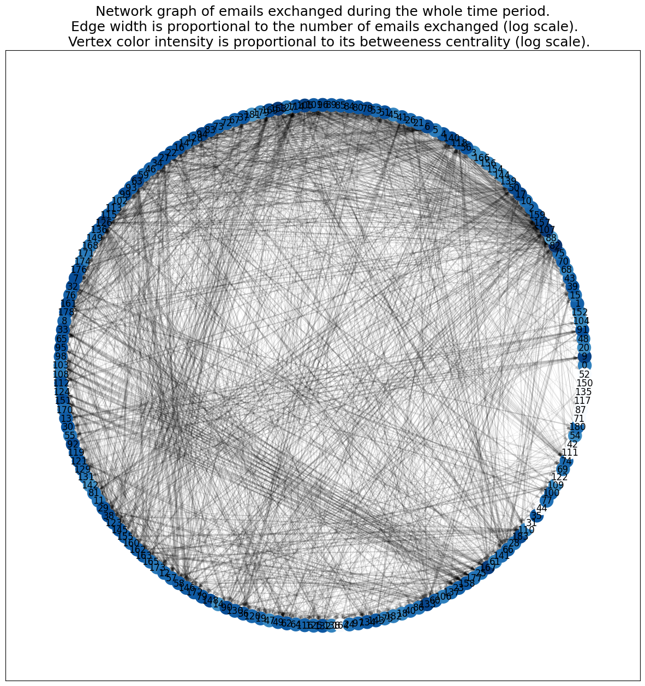
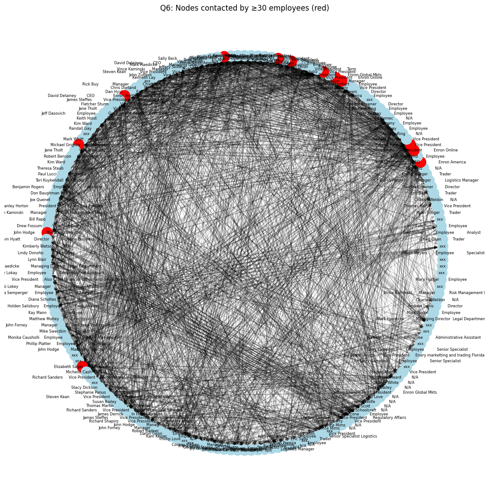
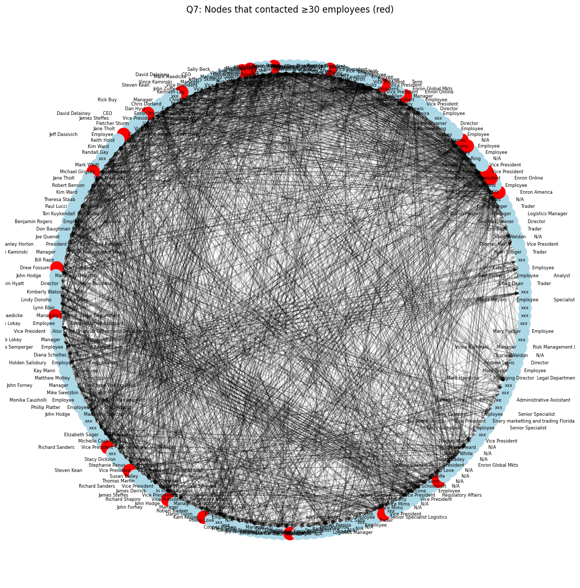
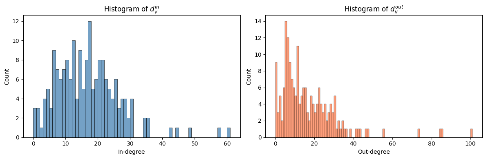
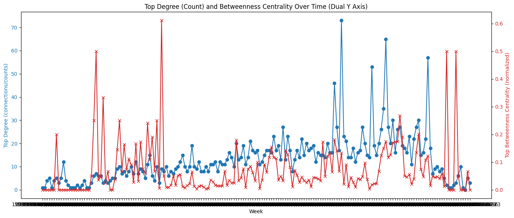
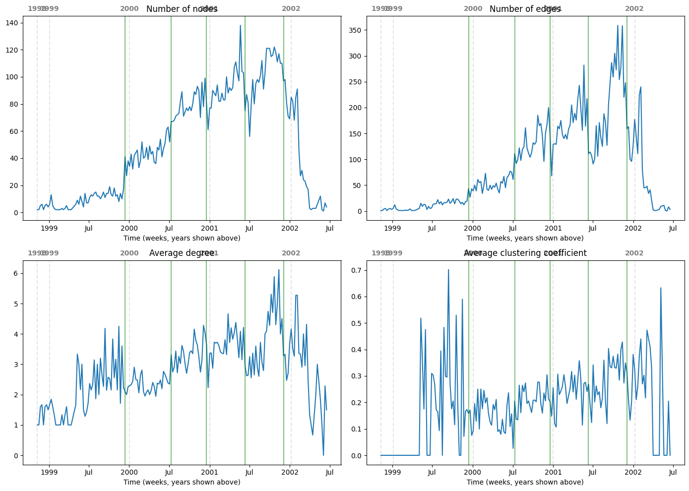

## CSC402 - Lab 1

Don Nguyen

knguy42@u.rochester.edu
## Part 1: Network Analysis
1. Number of directed edges (arcs): 3007

2. Number of undirected edges: 2097
3. Number of mutual arcs: 910

4. Number of nodes with d_in = 0: 3
   Employee names: Vince Kaminski      Manager            Risk Management Head, Mary Fischer        Employee, xxx

5. Number of nodes with d_out = 0: 9
   Employee names: xxx, Michelle Lokay         Employee           Administrative Asisstant, Mark Haedicke          Managing Director  Legal Department, Mark Taylor            Employee, Vince Kaminski      Manager            Risk Management Head, xxx, Mary Fischer        Employee, xxx, xxx

6. Employees contacted by ≥30 employees: 13

7. Employees who contacted ≥30 employees: 24

8. In-degree and out-degree histograms

## Part 2: Changes in the Network Graph
9. Centrality over time: two measures (e.g. degree centrality, betweenness)
**Who was most central?**
**Entire graph:** Most central by degree: **Stephanie Panus        Employee**. Most central by betweenness: **Chris Germany       Employee**.
**Per week:**
Top 10 individuals as most central by degree over weeks:
- Mark Taylor            Employee: 44 weeks
- Tana Jones             N/A: 30 weeks
- Louise Kitchen      President          Enron Online: 11 weeks
- John Lavorato          CEO                Enron America: 11 weeks
- xxx: 10 weeks
- Mark Haedicke          Managing Director  Legal Department: 8 weeks
- James Steffes          Vice President     Government Affairs: 8 weeks
- Michael Grigsby         Manager: 8 weeks
- Chris Germany       Employee: 6 weeks
- David Delainey         CEO                Enron North America and Enron Enery Services: 5 weeks

While Stephanie Panus was only most central employee by degree in a week once, over the entire graph, she was the most central.10. Graph-level statistics over time (identify Enron Online launch, Cooper CEO, etc.)

10. Change-point detection and interpretation (Summary)
- **First change point (around late 1999 / early 2000):** The series move from a low, relatively flat level to a clear **growth** phase: nodes and edges begin to rise more steadily, and week-over-week changes become larger and more variable. This aligns with the **launch of Enron Online**, which would be expected to increase trading-related communication and thus email activity.

- **Middle change points (mid-2000, mid-2001):** These fall during the sustained growth period and mark further shifts in the level (or pattern) of activity—e.g. changes in growth rate or in who is active in the network.

- **Fourth change point (early 2002, near the peak):** The network is at or near its maximum size and connectivity; the level series are at their highest before the drop.

- **Fifth change point (early 2002, in the decline):** The level of edges (and related statistics) drops sharply; the rate-of-change plots show large negative week-over-week changes. This aligns with **Stephen Cooper’s ascent to CEO** and the post-bankruptcy restructuring (Enron filed for bankruptcy in December 2001; Cooper became CEO in early 2002), when many employees left and email traffic collapsed.

**Interpretation in one sentence:** We used graph-level statistics over time and a simple, logic-based change-point rule on the number of edges to identify five weeks where the network’s activity level changed the most; the first and last of these align with the launch of Enron Online and with Cooper’s ascent to CEO and the ensuing collapse of the email network.

11. Compute and print the graph Laplacian matrix L for Karate club (L = D - A):
tensor([[16., -1., -1.,  ..., -1.,  0.,  0.],
        [-1.,  9., -1.,  ...,  0.,  0.,  0.],
        [-1., -1., 10.,  ...,  0., -1.,  0.],
        ...,
        [-1.,  0.,  0.,  ...,  6., -1., -1.],
        [ 0.,  0., -1.,  ..., -1., 12., -1.],
        [ 0.,  0.,  0.,  ..., -1., -1., 17.]])

12. Zero eigenvalue and ones vector
   L @ ones ≈ 0: True
   First eigenvector proportional to ones: True

13. Symmetric and positive semidefinite
   is L symmetric: True
   Min eigenvalue ≥ 0: True

14. Signed incidence matrix B_tilde: L = B_tilde @ B_tilde.T
   L = B_tilde @ B_tilde.T: True

