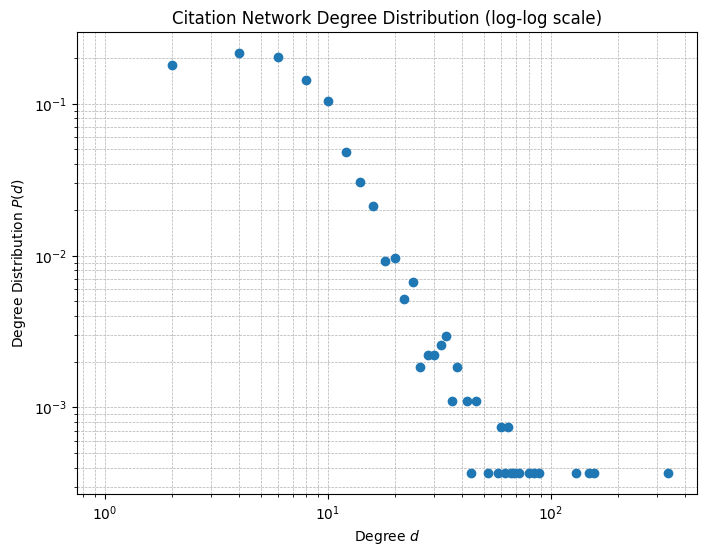
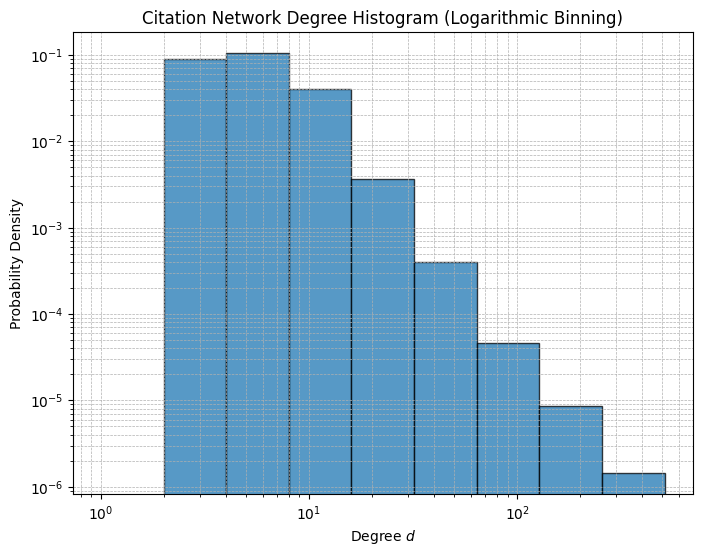
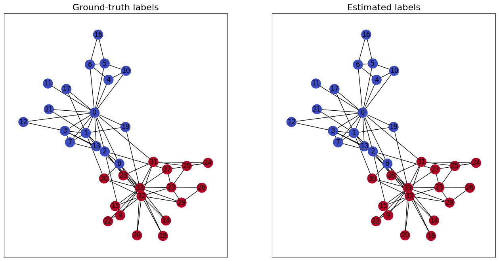
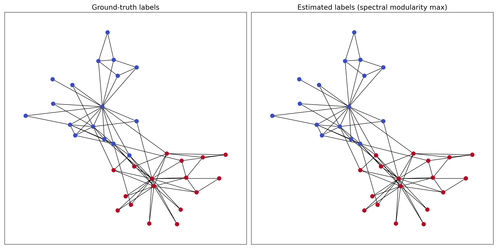

# ECE 442 Network Science Analytics - Laboratory 2 Report
## Descriptive Analysis of Network Graph Characteristics

---

## 1. Introduction
In this laboratory, we analyzed structural properties of large-scale networks, focusing on degree distributions, power-law / scale-free behavior, Pareto-based estimation of the power-law exponent, and assortative mixing captured via modularity. We also implemented classic spectral community detection methods—spectral graph partitioning and spectral modularity maximization—and evaluated their performance on Zachary’s Karate Club and a network of US political blogs using clustering-quality metrics (Adjusted Rand index and Fowlkes-Mallows index).

---

## 2. Structural Properties of Large-Scale Networks

### 2.1 Degree Distribution

**Question 1:** Write a function that computes the degree distribution of a graph given its degree sequence. The function `numpy.histogram` may be useful to that end.

**Response:**
- Describe your implementation:
  - Use `np.histogram` with bins centered on non-negative integer degrees (bins `[-0.5, 0.5, 1.5, ..., max_degree+0.5]`).
  - Normalize histogram counts so the resulting vector sums to 1, producing an empirical estimate of `P(d)`.
- Show the function code:

```python
def degree_distribution(degree_sequence):
  # TODO: Implement this function that takes the graph's degree sequence as input
  # and returns its degree distribution

  degree_distribution = []

  ############# your code here #############
  max_degree = np.max(degree_sequence)
  counts, bins = np.histogram(degree_sequence, bins=np.arange(-0.5, max_degree+1.5, 1))
  degree_distribution = counts / np.sum(counts)
  #########################################

  return degree_distribution
```
- Test results on the toy graph:
  - The degree distribution of the toy graph is `[0.1 0.2 0.4 0.2 0.1]`

---

### 2.2 Power-Law Distributions and Scale-Free Networks

**Question 2:** Plot the degree distribution $P(d)$ versus $d$ in log-log scale. Would you say the degree distribution obeys a power law? Discuss.

**Response:**
- Include log-log plot of degree distribution:
  - 
- #TODO: Analysis of whether power law is observed
- #TODO: Discussion of findings (e.g., tail behavior / deviations / robustness)

**Question 3:** Plot a histogram for the degrees of the citation network using bins of width $2^n$, for $n=0,1,2,\dots$. Do you still stand by your answer to Question 2? Are you more certain now as to whether the citation network can be characterized as scale-free?

**Response:**
- Include histogram with logarithmic binning:
  - 
- #TODO: Compare with previous analysis (Question 2)
- #TODO: Discussion of scale-free characterization and assessment of confidence

---

### 2.3 Pareto Distribution and Estimation of the Power-Law Exponent $\alpha$

**Question 4:** Determine the value of the constant $C$ so that $p(d)$ is a valid pdf.

**Response:**
Assume the Pareto-like model
$$
p(d)=C d^{-\alpha}, \quad d\ge d_{\min},
$$
and $p(d)=0$ otherwise. For $\alpha>1$, impose normalization:
$$
1=\int_{d_{\min}}^{\infty} C d^{-\alpha}\,dd
= C\left[ \frac{d^{-(\alpha-1)}}{\alpha-1} \right]_{d_{\min}}^{\infty}
= C\cdot \frac{d_{\min}^{-(\alpha-1)}}{\alpha-1}.
$$
Therefore,
$$
C=(\alpha-1)d_{\min}^{\alpha-1}.
$$

---

### 2.3 (continued) Pareto MLE and Exponent Estimation

**Question 5:** Write a function that implements the aforementioned MLE, given the degree sequence and $d_{\min}$ as inputs. Estimate the power-law exponent for the citation network.

**Response:**
- Describe MLE implementation:
  - Filter degrees to keep only $d_i\ge d_{\min}$.
  - Let $n$ be the number of remaining samples.
  - Compute
    $$
    \hat{\alpha}=1+\frac{n}{\sum_{i=1}^n \log(d_i/d_{\min})}.
    $$
- Show function code:

```python
def alpha_maximum_likelihood(deg_sequence, d_min):
  # TODO: Implement this function that takes the graph's degree sequence and
  # the degree lower bound (from which a power law is credible) as inputs, and
  # returns the MLE of α

  alpha_hat = 0

  ############# your code here #############

  # Compute MLE of α for degrees >= d_min
  import numpy as np

  deg_sequence = np.array(deg_sequence)
  # Filter degrees >= d_min
  filtered_degrees = deg_sequence[deg_sequence >= d_min]

  n = len(filtered_degrees)
  if n == 0:
      raise ValueError("No degrees >= d_min. Choose a lower d_min.")

  logs = np.log(filtered_degrees / d_min)
  alpha_hat = 1 + n / np.sum(logs)
  #########################################

  return alpha_hat
```
- Report estimated $\hat{\alpha}$ value (citation network):
  - Using $d_{\min}=10$, the notebook computed:
    - $\hat{\alpha} = 4.030$
- #TODO: Discussion of the result (interpretation of the exponent; choice of $d_{\min}$; plausibility of the tail fit)

---

### 2.4 Assortative Mixing and the Modularity Coefficient

**Question 6:** Compute the modularity coefficient for the airport and paper citation networks.

**Response:**
- Report modularity coefficient for USA airports network:
  - `mod_airports = 0.1082`
- Report modularity coefficient for Cora citation network:
  - `mod_citation = 0.1082`
- Include relevant code/output:

```python
# For airport graph
airport_partition = communities_partition(airports_data.y.numpy())
mod_airports = nx.algorithms.community.modularity(G_airports, airport_partition)
print(f"Modularity coefficient for USA airports network: {mod_airports:.4f}")

# For citation network
G_citation = to_networkx(airports_data)  # NOTE: see #TODO below
citation_partition = communities_partition(airports_data.y.numpy())
mod_citation = nx.algorithms.community.modularity(G_citation, citation_partition)
print(f"Modularity coefficient for Cora citation network: {mod_citation:.4f}")
```

- #TODO: Verify that `G_citation` is built from `cora_data` (the notebook’s code uses `airports_data` in that cell). If you rerun correctly, update `mod_citation`.

---

**Question 7:** What do the respective values tell you about the structure of relational ties established in each of the networks?

**Response:**
- The modularity values are positive and relatively small (`~0.1082` in both cases), indicating modest assortative mixing: edges are more likely to connect nodes within the same label/class than would be expected under a degree-preserving random baseline.
- #TODO: Discussion for citation network (connect observed modularity to expected topical similarity / homophily)
- #TODO: Discussion for airports network (connect observed modularity to expected activity/quartile-based grouping)
- #TODO: Comparison between the two networks

---

## 3. Community Detection

### 3.1 Spectral Graph Partitioning

**Question 8:** Implement the spectral graph partitioning algorithm we discussed in class.

**Response:**
- Describe algorithm implementation:
  - Compute the graph Laplacian `L`.
  - Eigen-decompose `L` and take the Fiedler vector (eigenvector for the second-smallest eigenvalue).
  - Sort vertices by the Fiedler-vector entry.
  - Assign the lowest `n1` entries to one community and the next `n2` entries to the other community.
- Show function code:

```python
def spectral_partitioning(G,n_1,n_2):
  # TODO: Implement the spectral graph partitioning algorithm. This function
  # takes as input a graph G in NetworkX format and two integers n_1 and n_2
  # (given community sizes). It returns a numpy vector with class assignments
  # for each vertex, coded using two different integers of your choice.

  communities_assignments = np.zeros((G.number_of_nodes(),))

  ############# your code here #############
  # Compute graph Laplacian
  L = nx.laplacian_matrix(G).astype(float)
  # Compute eigenvalues and eigenvectors
  eigvals, eigvecs = np.linalg.eigh(L.toarray())
  # Fiedler vector is the eigenvector corresponding to the second-smallest eigenvalue
  fiedler_vector = eigvecs[:, 1]  # eigenvectors are columns, eigvecs[:,0] is trivial
  # Sort nodes by value in Fiedler vector
  sorted_indices = np.argsort(fiedler_vector)
  # Assign n_1 nodes with lowest Fiedler vector values to one community, rest to other
  communities_assignments = np.zeros(G.number_of_nodes(), dtype=int)
  communities_assignments[sorted_indices[:n_1]] = -1
  communities_assignments[sorted_indices[n_1:n_1+n_2]] = 1

  #########################################

  return communities_assignments
```
- Results on Zachary's Karate Club:
  - Visualization:
    - 
  - Adjusted Rand index:
    - `1.000`
  - Fowlkes-Mallows index:
    - `1.000`
- #TODO: Discussion of performance (why spectral partitioning works well here; how errors might appear for other graphs)

---

### 3.2 Spectral Modularity Maximization

**Question 9:** Implement the spectral modularity maximization algorithm.

**Response:**
- Describe algorithm implementation:
  - Compute modularity matrix `B = nx.modularity_matrix(G)`.
  - Compute its leading eigenvector.
  - Split vertices into two communities based on the sign of the leading eigenvector entries.
- Show function code:

```python
def spectral_modularity_maximization(G):
  # TODO: Implement the spectral modularity maximization algorithm. This function
  # takes as input a graph G in NetworkX format. It returns a numpy vector with
  # class assignments for each vertex, coded using two different integers of
  # your choice.

  communities_assignments = np.zeros((G.number_of_nodes(),))

  ############# your code here #############
  # Compute the modularity matrix
  B = nx.modularity_matrix(G)
  # Compute the leading eigenvector of the modularity matrix
  eigvals, eigvecs = np.linalg.eigh(B)
  leading_eigvec = eigvecs[:, np.argmax(eigvals)]
  # Assign nodes to two communities based on sign of eigenvector
  communities_assignments = (leading_eigvec > 0).astype(int)

  #########################################

  return communities_assignments
```
- Results on Zachary's Karate Club:
  - Visualization:
    - 
  - Note:
    - After aligning predicted labels to ground truth, the method correctly labels all vertices except **node 8**.
  - Adjusted Rand index:
    - `0.882`
  - Fowlkes-Mallows index:
    - `0.939`
- Comparison with spectral partitioning results:
  - Spectral partitioning achieved perfect recovery on this graph, while modularity maximization is slightly less accurate (one-node discrepancy here).
  - #TODO: Provide a deeper comparison (role of knowing community sizes vs. optimizing modularity)

---

### 3.3 Partitioning a Network of US Political Blogs

**Question 10:** Qualitative comparison + limitations of spectral modularity maximization.

**Response:**
- Results on Political Blogs network:
  - **#TODO:** Cannot download PolBlogs in this environment (`403 Forbidden` from the dataset host), so ARI/Fowlkes and the visualization for Q10 are not computed here.
  - Please either:
    - provide `polblogs.tar.gz` (or `adjacency.tsv` + `labels.tsv`) in the workspace, then I can compute and fill the values, or
    - rerun the notebook in an environment with dataset download access and paste the ARI/Fowlkes results here.
  - Placeholder for metrics:
    - Adjusted Rand index score: `#TODO`
    - Fowlkes-Mallows index score: `#TODO`
- #TODO: Include the visualization (ground truth vs. estimated labels) once PolBlogs data is available.
- #TODO: Qualitative comparison of visualizations
- #TODO: Discussion of limitations
  - When does spectral modularity maximization work well?
  - What are its limitations?
  - Comparison with spectral partitioning approach

---

## 4. Optional Exercise (Extra Credit)

### 4.1 Maximum Likelihood Estimator of $\alpha$ in the Pareto Distribution

**Optional Question 1:** Show that the log-likelihood is:
$$
\ell_n(\alpha) = n \log (\alpha -1)-n\log d_{\min} - \alpha \sum_{i=1}^n \log \left(\frac{d_i}{d_{\min}}\right).
$$

**Response:**
For a Pareto model on $d\ge d_{\min}$:
$$
p(d)=C d^{-\alpha},\quad C=(\alpha-1)d_{\min}^{\alpha-1}.
$$
So for each observation $d_i$:
$$
p(d_i)=(\alpha-1)d_{\min}^{\alpha-1} \, d_i^{-\alpha}.
$$
The likelihood is:
$$
L(\alpha)=\prod_{i=1}^n (\alpha-1)d_{\min}^{\alpha-1} \, d_i^{-\alpha}
= (\alpha-1)^n \, d_{\min}^{n(\alpha-1)} \prod_{i=1}^n d_i^{-\alpha}.
$$
Taking logs:
$$
\ell_n(\alpha)=n\log(\alpha-1)+n(\alpha-1)\log d_{\min}-\alpha\sum_{i=1}^n \log d_i.
$$
Rearrange the middle term:
$$
n(\alpha-1)\log d_{\min} = n\alpha\log d_{\min} - n\log d_{\min}.
$$
Thus:
$$
\ell_n(\alpha)=n\log(\alpha-1)-n\log d_{\min}-\alpha\sum_{i=1}^n \left(\log d_i-\log d_{\min}\right)
$$
$$
=n\log(\alpha-1)-n\log d_{\min}-\alpha\sum_{i=1}^n \log\left(\frac{d_i}{d_{\min}}\right),
$$
which matches the required expression.

---

**Optional Question 2:** Conclude that the MLE is:
$$
\hat{\alpha} = 1 + n \left[\sum_{i=1}^n \log \left(\frac{d_i}{d_{\min}}\right)\right]^{-1}.
$$

**Response:**
Differentiate the log-likelihood w.r.t. $\alpha$:
$$
\ell_n(\alpha)=n\log(\alpha-1)-n\log d_{\min}-\alpha\sum_{i=1}^n \log\left(\frac{d_i}{d_{\min}}\right).
$$
Let
$$
S=\sum_{i=1}^n \log\left(\frac{d_i}{d_{\min}}\right).
$$
Then:
$$
\frac{d\ell_n}{d\alpha} = \frac{n}{\alpha-1} - S.
$$
Set derivative to zero:
$$
\frac{n}{\alpha-1} = S \quad\Rightarrow\quad \alpha-1 = \frac{n}{S}.
$$
Therefore:
$$
\hat{\alpha}=1+\frac{n}{\sum_{i=1}^n \log\left(\frac{d_i}{d_{\min}}\right)}.
$$

---

## 5. Conclusion
Key findings from this lab:
- The empirical degree distribution can be computed via histogram binning; the toy graph test matches the expected distribution.
- For the Cora citation network, the degree tail is consistent with a scale-free / power-law trend over a limited range, and the Pareto MLE estimate yields $\hat{\alpha}\approx 4.030$ (using $d_{\min}=10$).
- Modularity coefficients are positive for both the airport network and the citation network, indicating modest assortative structure with respect to the chosen node labels.
- On Zachary’s Karate Club, spectral graph partitioning perfectly recovers the ground-truth partition (ARI=1.000, Fowlkes-Mallows=1.000), while spectral modularity maximization misclassifies only node 8 (ARI=0.882, Fowlkes-Mallows=0.939).

Limitations and future work:
- #TODO: Add a paragraph about limitations (choice of $d_{\min}$, modularity resolution limit, sensitivity to eigenvector sign, and scalability).

---

## Appendix

### Code implementations (used for report)

```python
def communities_partition(labels):
  # Function that, given a list of class membership labels for each vertex
  labels = np.asarray(labels)
  communities_labels = np.unique(labels)
  partition = [set(np.where(labels == community_idx)[0]) for community_idx in communities_labels]
  return partition
```

```python
def degree_distribution(degree_sequence):
  # TODO: Implement this function that takes the graph's degree sequence as input
  # and returns its degree distribution

  degree_distribution = []

  max_degree = np.max(degree_sequence)
  counts, bins = np.histogram(degree_sequence, bins=np.arange(-0.5, max_degree+1.5, 1))
  degree_distribution = counts / np.sum(counts)

  return degree_distribution
```

```python
def alpha_maximum_likelihood(deg_sequence, d_min):
  # TODO: Implement this function that takes the graph's degree sequence and
  # the degree lower bound (from which a power law is credible) as inputs, and
  # returns the MLE of α

  alpha_hat = 0

  import numpy as np

  deg_sequence = np.array(deg_sequence)
  filtered_degrees = deg_sequence[deg_sequence >= d_min]
  n = len(filtered_degrees)
  if n == 0:
      raise ValueError("No degrees >= d_min. Choose a lower d_min.")

  logs = np.log(filtered_degrees / d_min)
  alpha_hat = 1 + n / np.sum(logs)

  return alpha_hat
```

```python
def spectral_partitioning(G, n_1, n_2):
  # TODO: Implement the spectral graph partitioning algorithm.
  communities_assignments = np.zeros((G.number_of_nodes(),))

  L = nx.laplacian_matrix(G).astype(float)
  eigvals, eigvecs = np.linalg.eigh(L.toarray())
  fiedler_vector = eigvecs[:, 1]

  sorted_indices = np.argsort(fiedler_vector)
  communities_assignments = np.zeros(G.number_of_nodes(), dtype=int)
  communities_assignments[sorted_indices[:n_1]] = -1
  communities_assignments[sorted_indices[n_1:n_1+n_2]] = 1

  return communities_assignments
```

```python
def spectral_modularity_maximization(G):
  # TODO: Implement the spectral modularity maximization algorithm.
  communities_assignments = np.zeros((G.number_of_nodes(),))

  B = nx.modularity_matrix(G)
  eigvals, eigvecs = np.linalg.eigh(B)
  leading_eigvec = eigvecs[:, np.argmax(eigvals)]
  communities_assignments = (leading_eigvec > 0).astype(int)

  return communities_assignments
```

### Figures saved for report
- `report_figures/lab2_q2_degree_distribution_loglog.png`
- `report_figures/lab2_q3_degree_histogram_log_bins.png`
- `report_figures/lab2_q8_karate_spectral_partition.png`
- `report_figures/lab2_q9_karate_spectral_modularity_max.png`

